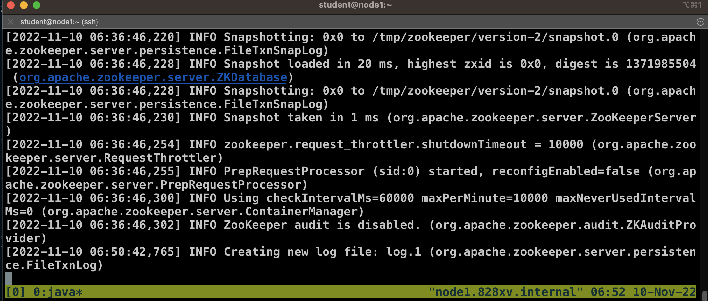
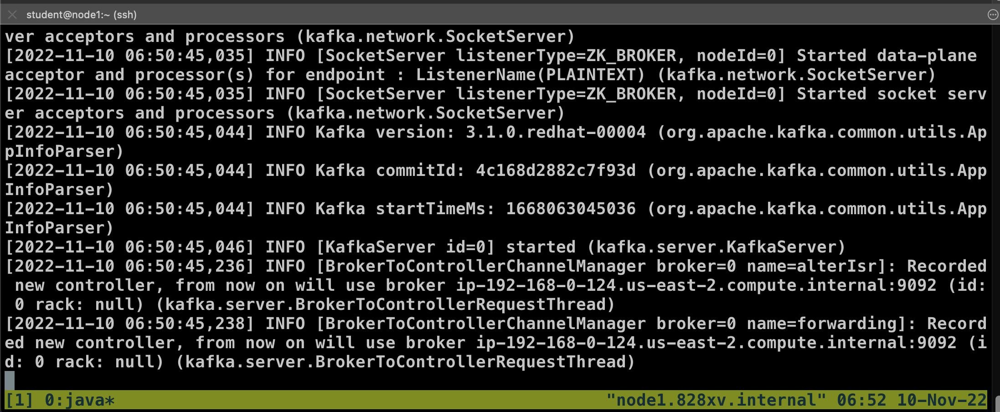
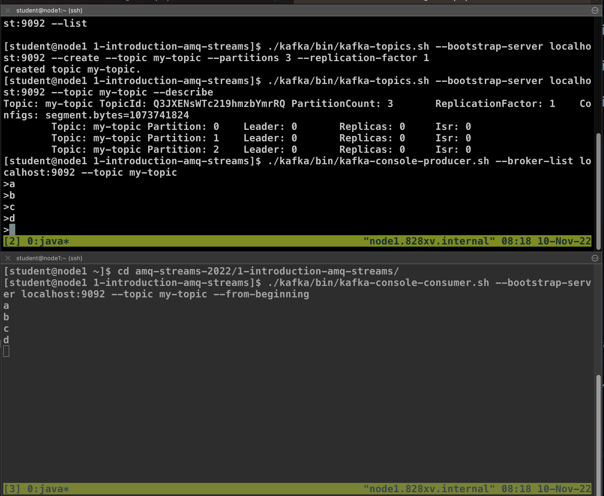

# Introduction to Red Hat AMQ Streams

Basic Red Hat AMQ Streams:

<!-- TOC -->

- [Introduction to Red Hat AMQ Streams](#introduction-to-red-hat-amq-streams)
  - [Prerequisite](#prerequisite)
  - [Basic Start with Zookeeper](#basic-start-with-zookeeper)
  - [Basic Start Kafka Broker](#basic-start-kafka-broker)
  - [Basic Create Kafka Topic](#basic-create-kafka-topic)
  - [Basic Consuming and producing messages](#basic-consuming-and-producing-messages)
  - [Stop Zookeeper & Kafka Broker](#stop-zookeeper--kafka-broker)

<!-- /TOC -->

## Prerequisite

* [Setup Red Hat AMQ Streams Lab](./../setup.md)

## Basic Start with Zookeeper

* go to lab folder 1-introduction-amq-streams
  ```bash
  cd ~/amq-streams-2022/1-introduction-amq-streams
  ```
* First before we start Kafka, we have to start ZooKeeper, start zookeeper with command line (For testing, we start only 1 server.)
  ```bash
  ./kafka/bin/zookeeper-server-start.sh ./kafka/config/zookeeper.properties
  ```
* review [zookkeper.properties](kafka/config/zookeeper.properties), see detail of zookeeper configuration
  ```properties
  # the directory where the snapshot is stored.
  dataDir=/tmp/zookeeper
  # the port at which the clients will connect
  clientPort=2181
  # disable the per-ip limit on the number of connections since this is a non-production config
  maxClientCnxns=0
  # Disable the adminserver by default to avoid port conflicts.
  # Set the port to something non-conflicting if choosing to enable this
  admin.enableServer=false
  # admin.serverPort=8080
  ```

* wait until zookeeper start complete
  ```bash
  ...
  [2022-11-10 06:36:46,300] INFO Using checkIntervalMs=60000 maxPerMinute=10000 maxNeverUsedIntervalMs=0 (org.apache.zookeeper.server.ContainerManager)
  [2022-11-10 06:36:46,302] INFO ZooKeeper audit is disabled. (org.apache.zookeeper.audit.ZKAuditProvider)
  ```
* zookeeper terminal
  

## Basic Start Kafka Broker

* Next we can start Kafka Broker, open new terminal by repeat step in [Connect to RHPDS VM Lab](./../setup.md#connect-to-rhpds-vm-lab) and run command (For testing, we start only 1 server.)
  ```
  cd ~/amq-streams-2022/1-introduction-amq-streams
  ./kafka/bin/kafka-server-start.sh ./kafka/config/server.properties
  ```
* review [server.properties](kafka/config/server.properties), see detail of server configuration
  ```properties
  ...
  # The id of the broker. This must be set to a unique integer for each broker.
  broker.id=0
  ...
  # The number of threads that the server uses for receiving requests from the network and sending responses to the network
  num.network.threads=3

  # The number of threads that the server uses for processing requests, which may include disk I/O
  num.io.threads=8

  # The send buffer (SO_SNDBUF) used by the socket server
  socket.send.buffer.bytes=102400

  # The receive buffer (SO_RCVBUF) used by the socket server
  socket.receive.buffer.bytes=102400

  # The maximum size of a request that the socket server will accept (protection against OOM)
  socket.request.max.bytes=104857600

  # A comma separated list of directories under which to store log files
  log.dirs=/tmp/kafka-logs

  # The default number of log partitions per topic. More partitions allow greater
  # parallelism for consumption, but this will also result in more files across
  # the brokers.
  num.partitions=1

  # The number of threads per data directory to be used for log recovery at startup and flushing at shutdown.
  # This value is recommended to be increased for installations with data dirs located in RAID array.
  num.recovery.threads.per.data.dir=1

  # The replication factor for the group metadata internal topics "__consumer_offsets" and "__transaction_state"
  # For anything other than development testing, a value greater than 1 is recommended to ensure availability such as 3.
  offsets.topic.replication.factor=1
  transaction.state.log.replication.factor=1
  transaction.state.log.min.isr=1

  # The minimum age of a log file to be eligible for deletion due to age
  log.retention.hours=168

  # The maximum size of a log segment file. When this size is reached a new log segment will be created.
  log.segment.bytes=1073741824

  # The interval at which log segments are checked to see if they can be deleted according
  # to the retention policies
  log.retention.check.interval.ms=300000

  # Zookeeper connection string (see zookeeper docs for details).
  # This is a comma separated host:port pairs, each corresponding to a zk
  # server. e.g. "127.0.0.1:3000,127.0.0.1:3001,127.0.0.1:3002".
  # You can also append an optional chroot string to the urls to specify the
  # root directory for all kafka znodes.
  zookeeper.connect=localhost:2181

  # Timeout in ms for connecting to zookeeper
  zookeeper.connection.timeout.ms=18000  
  ...
  ```
* wait unti kafka start complete
  ```bash
  [2022-11-10 06:50:45,035] INFO [SocketServer listenerType=ZK_BROKER, nodeId=0] Started data-plane acceptor and processor(s) for endpoint : ListenerName(PLAINTEXT) (kafka.network.SocketServer)
  [2022-11-10 06:50:45,035] INFO [SocketServer listenerType=ZK_BROKER, nodeId=0] Started socket server acceptors and processors (kafka.network.SocketServer)
  [2022-11-10 06:50:45,044] INFO Kafka version: 3.1.0.redhat-00004 (org.apache.kafka.common.utils.AppInfoParser)
  [2022-11-10 06:50:45,044] INFO Kafka commitId: 4c168d2882c7f93d (org.apache.kafka.common.utils.AppInfoParser)
  [2022-11-10 06:50:45,044] INFO Kafka startTimeMs: 1668063045036 (org.apache.kafka.common.utils.AppInfoParser)
  [2022-11-10 06:50:45,046] INFO [KafkaServer id=0] started (kafka.server.KafkaServer)
  [2022-11-10 06:50:45,236] INFO [BrokerToControllerChannelManager broker=0 name=alterIsr]: Recorded new controller, from now on will use broker ip-192-168-0-124.us-east-2.compute.internal:9092 (id: 0 rack: null) (kafka.server.BrokerToControllerRequestThread)
  [2022-11-10 06:50:45,238] INFO [BrokerToControllerChannelManager broker=0 name=forwarding]: Recorded new controller, from now on will use broker ip-192-168-0-124.us-east-2.compute.internal:9092 (id: 0 rack: null) (kafka.server.BrokerToControllerRequestThread)
  ```
* kafka broker terminal
  
  
## Basic Create Kafka Topic

* List the topics using Kafka, open new terminal and run command
  ```bash
  ./kafka/bin/kafka-topics.sh --bootstrap-server localhost:9092 --list
  ```
* no topic show in terminal
* create sample new topic which we will use
  ```bash
  ./kafka/bin/kafka-topics.sh --bootstrap-server localhost:9092 --create --topic my-topic --partitions 3 --replication-factor 1
  ```
  result of create topic command
  ```bash
  Created topic my-topic.
  ```
* List the topics again to see it was created.
  ```bash
  ./kafka/bin/kafka-topics.sh --bootstrap-server localhost:9092 --list
  ```
* Describe the topic to see more details:
  ```bash
  ./kafka/bin/kafka-topics.sh --bootstrap-server localhost:9092 --topic my-topic --describe
  ```
* example output
  ```
  Topic: my-topic	TopicId: CXoa2jvVScmiOx6wWx0VzQ	PartitionCount: 3	ReplicationFactor: 1	Configs: segment.bytes=1073741824
  	Topic: my-topic	Partition: 0	Leader: 0	Replicas: 0	Isr: 0
	Topic: my-topic	Partition: 1	Leader: 0	Replicas: 0	Isr: 0
	Topic: my-topic	Partition: 2	Leader: 0	Replicas: 0	Isr: 0
  ```

## Basic Consuming and producing messages

* Start the console producer for create and send message to topic
  ```bash
  ./kafka/bin/kafka-console-producer.sh --broker-list localhost:9092 --topic my-topic
  ```
* Wait until it is ready (it should show `>`).
* Next we can consume the messages, open new terminal and run command
  ```bash
  ./kafka/bin/kafka-console-consumer.sh --bootstrap-server localhost:9092 --topic my-topic --from-beginning
  ```
* Once ready, back to producer terminal and send some message by typing the message payload and pressing enter to send. such as
  ```bash
  >a
  >b
  >c
  >
  ```
* see output in consumer terminal:
  ```bash
  a
  b
  c
  ```
  example result in terminal
  

* exit from producer console by type ctrl+c in producer console terminal
* You can also check the consumer groups:
  ```bash
  ./kafka/bin/kafka-consumer-groups.sh --bootstrap-server localhost:9092 --describe --all-groups
  ```
  example result
  ```bash
  GROUP                  TOPIC           PARTITION  CURRENT-OFFSET  LOG-END-OFFSET  LAG             CONSUMER-ID                                           HOST            CLIENT-ID
  console-consumer-16045 my-topic        0          -               2               -               console-consumer-836b8dc7-50a8-4c4d-a1d7-f227607dff33 /192.168.0.124  console-consumer
  console-consumer-16045 my-topic        1          -               1               -               console-consumer-836b8dc7-50a8-4c4d-a1d7-f227607dff33 /192.168.0.124  console-consumer
  console-consumer-16045 my-topic        2          -               1               -               console-consumer-836b8dc7-50a8-4c4d-a1d7-f227607dff33 /192.168.0.124  console-consumer
  ```
* exit from consumer console by type ctrl+c in consumer console terminal
* check the consumer groups again:
  ```
  ./kafka/bin/kafka-consumer-groups.sh --bootstrap-server localhost:9092 --describe --all-groups
  ```
  example result
  ```bash
  Consumer group 'console-consumer-16045' has no active members.
  ```
* check zookeeper and java process 
  ```bash
  jps
  ```
  example result
  ```bash
  1749 QuorumPeerMain 
  6774 Jps
  2319 Kafka
  ```
  - process "QuorumPeerMain" is zookeeper
  - process "Kafka" is kafka broker

## Stop Zookeeper & Kafka Broker

* run stop server command in another terminal
  ```bash 
  ./kafka/bin/kafka-server-stop.sh
  ./kafka/bin/zookeeper-server-stop.sh
  ```
* or type ctrl + c in kafka terminal and zookeeper terminal
* check with jps command again (if stop complete, kafka and QuorumPeerMain will disappear)