# Red Hat AMQ Streams Architecture

<!-- TOC -->

- [Red Hat AMQ Streams Architecture](#red-hat-amq-streams-architecture)
  - [Prerequisite](#prerequisite)
  - [Clean AMQ Streams Data](#clean-amq-streams-data)
  - [Generate the certificates](#generate-the-certificates)
  - [Start ZooKeeper cluster](#start-zookeeper-cluster)
  - [Start Kafka cluster](#start-kafka-cluster)
  - [Zookeeper](#zookeeper)
    - [Show what Kafka does in Zookeeper](#show-what-kafka-does-in-zookeeper)
  - [Basics Operation with Cluster](#basics-operation-with-cluster)
    - [Create topic](#create-topic)
    - [Check the created topic](#check-the-created-topic)
    - [Send some messages](#send-some-messages)
    - [Consume messages](#consume-messages)
  - [Replication](#replication)
    - [Test Broker crash](#test-broker-crash)
    - [Consume messages](#consume-messages-1)
    - [Send some new messages](#send-some-new-messages)
    - [Start the broker 2 again](#start-the-broker-2-again)

<!-- /TOC -->

## Prerequisite

* [Setup Red Hat AMQ Streams Lab](./../setup.md)
 
## Clean AMQ Streams Data

* make sure to stop all kafka & zookeeper server
  * by ctrl+c in your terminal or
  * call kafka-server-stop.sh for kafka broker and call zookeeper-server-stop.sh for zookeeper
* clear zookeeper & kafka data
  ```bash
  rm -rf /tmp/zookeeper*
  rm -rf /tmp/kafka*
  ```

## Generate the certificates 
* create certificate for enable ssl connection to amq streams cluster
* review [generate.sh](ssl/generate.sh) and run for create certificate
  ```bash
  cd ~/amq-streams-2022/2-amq-streams-architecture/
  ./ssl/generate.sh
  ```
* example result of generate.sh (path ~/amq-streams-2022/2-amq-streams-architecture/ssl/keys, don't worry about warning in result!). 
 
  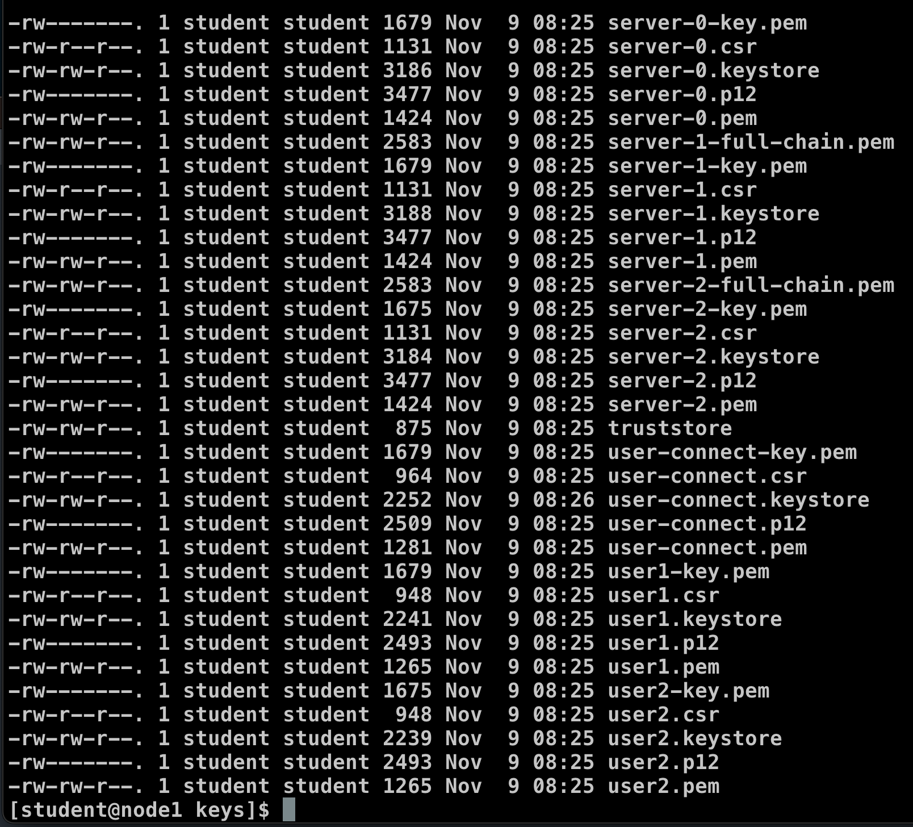
  
## Start ZooKeeper cluster

First before we start Kafka, we have to start ZooKeeper cluster.
We will use 3 node cluster.
Start the 3 Zookeeper nodes by running these 3 scripts in different terminals.
Don't worry about error after run zookeeper-0.sh (error about QuorumPeer):

* Look at the Zookeeper config files in `./configs/zookeeper/`, review [zookeeper-1.properties](configs/zookeeper/zookeeper-1.properties), zookeeper-2.properties, zookeeper-3.properties
  - Look at the ensemble configuration in the Zookeeper properties files
  - Check the content of the Zookeeper data dirs in `/tmp`
  - Notice the `myid` file which needs to be created before starting Zookeeper with the node ID 
  - client port
  - zookeeper server list (server.1,server.2,server.3)
  - client to server security config (this lab use 'SASL')
  - server to server security config (this lab use 'SASL')
* review [jaas.config](configs/zookeeper/jaas.config) for authentication information
* run start zookeeper command in different terminal (1 shell script 1 terminal)
  ```bash
  cd ~/amq-streams-2022/2-amq-streams-architecture/
  ./scripts/zookeeper-0.sh
  ./scripts/zookeeper-1.sh
  ./scripts/zookeeper-2.sh
  ```
  example result
  
  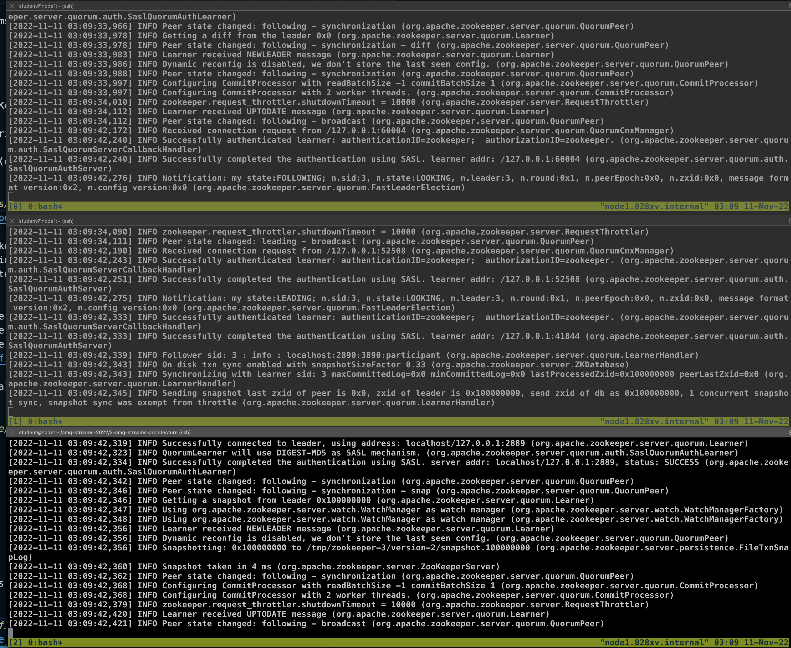
 
## Start Kafka cluster 

We will use 3 node Kafka cluster
Start the 3 Kafka nodes by running these 3 scripts in different terminals:

* Look at the Kafka configuration files in `./configs/kafka/`, review [server-0.properties](configs/kafka/server-0.properties), server-1.properties, server-2.properties
  - `broker.id`
  - listeners, advertised listeners, protocols
  - Zookeeper config
  - Look at the data dir in `/tmp`
  - Look at the tools in `./kafka/bin`
  - SASL, SSL (server to server, kafka to kafka & zookeeper to kafka use SASL Plaintext in this lab)
* review [jaas.config](configs/kafka/jaas.config) for authentication information
* run start kafka broker command in different terminal
  ```bash
  cd ~/amq-streams-2022/2-amq-streams-architecture/
  ./scripts/kafka-0.sh
  ./scripts/kafka-1.sh
  ./scripts/kafka-2.sh
  ```
  example result
  
  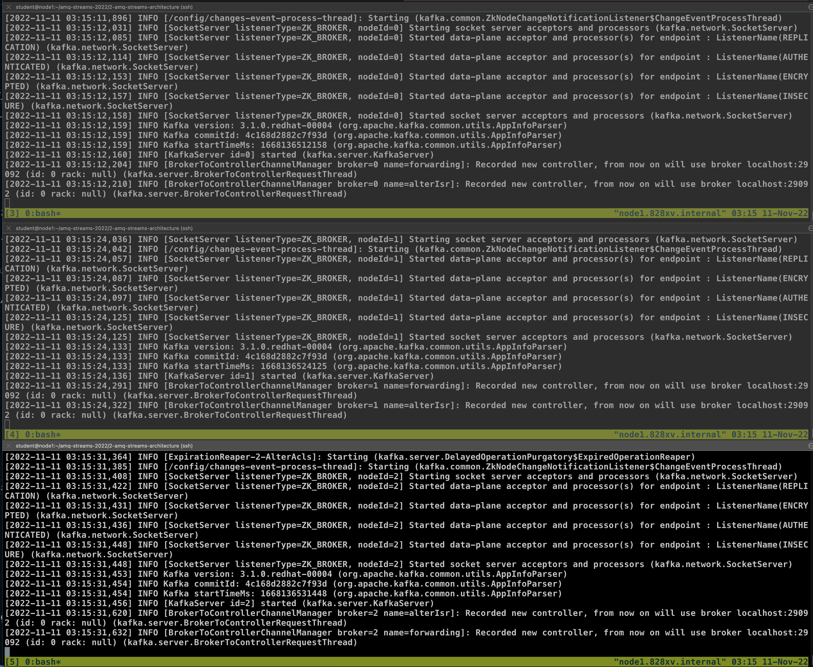
  

## Zookeeper

### Show what Kafka does in Zookeeper

* open new terminal
* Find and notice the ZK JAR files in `./kafka/libs` and `./kafka/bin` - Zookeeper is integrated into Kafka distribution (see in 2-amq-streams-architecture/)
* Start the ZK client
  ```bash
  cd ~/amq-streams-2022/2-amq-streams-architecture/
  ./kafka/bin/zookeeper-shell.sh localhost:2181
  ```

* Browse through the Zookeeper nodes with below command
  ```bash
  ls /
  get /controller
  ls /brokers
  ls /brokers/ids
  get /brokers/ids/0
  ls /brokers/topics
  ```
  example result
  
  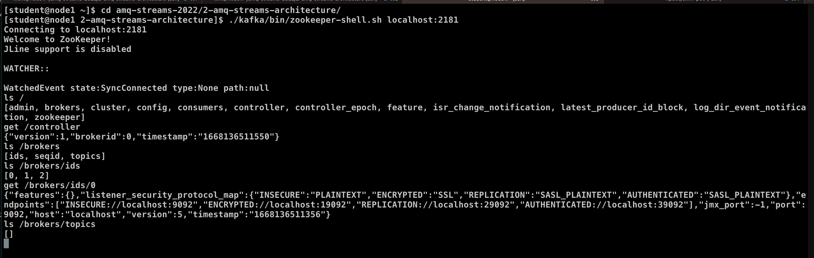

* Exit from zookeeper-shell with ctrl+c
* Try to do netcat dump with connected brokers

  ```bash
  echo dump | nc localhost 2181
  ```
  example result
  ```bash
  [student@node1 2-amq-streams-architecture]$ echo dump | nc localhost 2181
  SessionTracker dump:
  Global Sessions(4):
  0x100000d21e00000       18000ms
  0x100000d21e00001       30000ms
  0x300000d42930000       18000ms
  0x300000d42930001       18000ms
  ephemeral nodes dump:
  Sessions with Ephemerals (3):
  0x100000d21e00000:
          /controller
          /brokers/ids/0
  0x300000d42930000:
          /brokers/ids/1
  0x300000d42930001:
          /brokers/ids/2
  Connections dump:
  Connections Sets (4)/(2):
  0 expire at Fri Nov 11 04:16:53 UTC 2022:
  1 expire at Fri Nov 11 04:17:03 UTC 2022:
          ip: /0:0:0:0:0:0:0:1:50356 sessionId: 0x0
  1 expire at Fri Nov 11 04:17:13 UTC 2022:
          ip: /127.0.0.1:35092 sessionId: 0x100000d21e00000
  0 expire at Fri Nov 11 04:17:23 UTC 2022:
  [student@node1 2-amq-streams-architecture]$
  ```

* Kill broker 2 (type ctrl+c in kafka broker terminal #3) and do the netcat again to see how it disappeared
  
  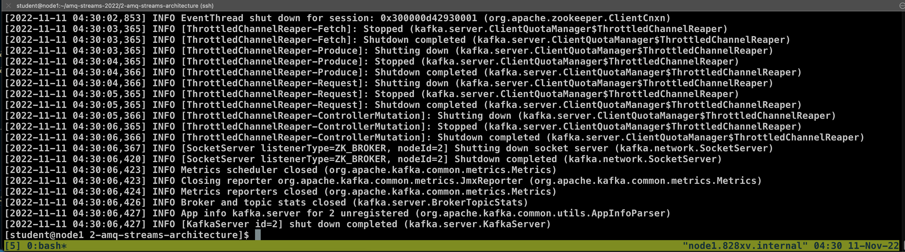  
  
  ```bash
  echo dump | nc localhost 2181
  ```
  example result after kill broker 2
  ```bash
  [student@node1 2-amq-streams-architecture]$ echo dump | nc localhost 2181
  SessionTracker dump:
  Global Sessions(2):
  0x100000d21e00000       18000ms
  0x300000d42930000       18000ms
  ephemeral nodes dump:
  Sessions with Ephemerals (2):
  0x100000d21e00000:
          /controller
          /brokers/ids/0
  0x300000d42930000:
          /brokers/ids/1
  Connections dump:
  Connections Sets (2)/(2):
  0 expire at Fri Nov 11 04:31:53 UTC 2022:
  2 expire at Fri Nov 11 04:32:03 UTC 2022:
          ip: /0:0:0:0:0:0:0:1:50396 sessionId: 0x0
          ip: /127.0.0.1:35092 sessionId: 0x100000d21e00000
  [student@node1 2-amq-streams-architecture]$
  ```
* start broker 2 again with command 
  ```bash
  cd ~/amq-streams-2022/2-amq-streams-architecture/
  ./scripts/kafka-2.sh
  ```
  
## Basics Operation with Cluster

### Create topic

  ```bash
  cd ~/amq-streams-2022/2-amq-streams-architecture/
  ./kafka/bin/kafka-topics.sh --bootstrap-server localhost:9092,localhost:9093,localhost:9094 --create --topic demo --partitions 3   --replication-factor 3
  ```
  example result
  ```bash
  Created topic demo.
  ```
### Check the created topic

  ```bash
  ./kafka/bin/kafka-topics.sh --bootstrap-server localhost:9093 --list
  ./kafka/bin/kafka-topics.sh --bootstrap-server localhost:9094 --describe --topic demo
  ```
  example result
  ```bash
  [student@node1 2-amq-streams-architecture]$ ./kafka/bin/kafka-topics.sh --bootstrap-server localhost:9094 --describe --topic demo
  Topic: demo     TopicId: YDf9yjTsTFqA2OPWtzJ4GQ PartitionCount: 3       ReplicationFactor: 3    Configs: segment.bytes=104857600
          Topic: demo     Partition: 0    Leader: 1       Replicas: 1,2,0 Isr: 1,2,0
          Topic: demo     Partition: 1    Leader: 0       Replicas: 0,1,2 Isr: 0,1,2
          Topic: demo     Partition: 2    Leader: 2       Replicas: 2,0,1 Isr: 2,0,1
  [student@node1 2-amq-streams-architecture]$
  ```
  Notice the distribution of leaders and the ISR replicas.

### Send some messages

* Send at least 10 messages (e.g. `Message 1`, `Message 2` etc. to be able to notice the ordering later), exit command with ctrl+c

  ```bash
  cd ~/amq-streams-2022/2-amq-streams-architecture/
  ./kafka/bin/kafka-console-producer.sh --broker-list localhost:9092 --topic demo
  ```
  example result
  
  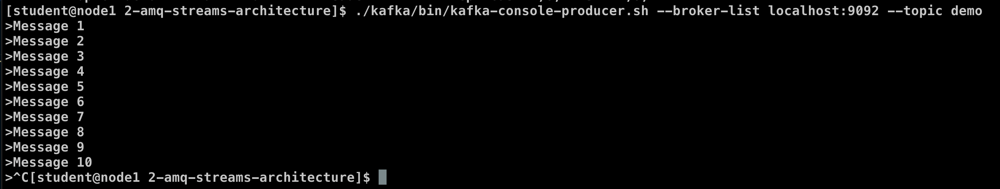

### Consume messages

* Read from the whole topic

  ```bash
  ./kafka/bin/kafka-console-consumer.sh --bootstrap-server localhost:9093 --topic demo --from-beginning
  ```
  example result
  
  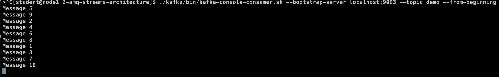

* Notice how the messages are out of order. And check how nicely ordered they are in a single partition. exit old console consumer and call it again and select only partition 0.

  ```bash
  ./kafka/bin/kafka-console-consumer.sh --bootstrap-server localhost:9092 --topic demo --partition 0 --from-beginning
  ```
  example result
  
  

* Reading from a particular offset (try to change partition and offset to test this command)

  ```bash
  ./kafka/bin/kafka-console-consumer.sh --bootstrap-server localhost:9092 --topic demo --partition 0 --offset 1
  ```
  example result
  
  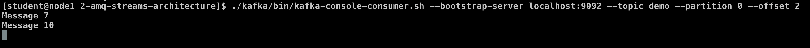

## Replication

### Test Broker crash

* View topic description with the leaders  and new ISR

  ```bash
  cd ~/amq-streams-2022/2-amq-streams-architecture/
  ./kafka/bin/kafka-topics.sh --bootstrap-server localhost:9092 --describe  --topic demo
  ```
  example result
  ```bash
  Topic: demo     TopicId: YDf9yjTsTFqA2OPWtzJ4GQ PartitionCount: 3       ReplicationFactor: 3    Configs: segment.bytes=1073741824
        Topic: demo     Partition: 0    Leader: 1       Replicas: 1,2,0 Isr: 1,2,0
        Topic: demo     Partition: 1    Leader: 0       Replicas: 0,1,2 Isr: 0,1,2
        Topic: demo     Partition: 2    Leader: 2       Replicas: 2,0,1 Isr: 2,0,1
  ```

* Kill broker 2 by ctrl+c in kafka terminal #2 (broker start with 0,1,2)
  
  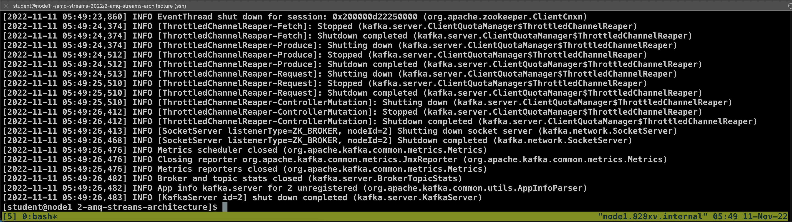
  
* Look again at the topic description with the leaders which changed and new ISR

  ```bash
  ./kafka/bin/kafka-topics.sh --bootstrap-server localhost:9092 --describe --topic demo
  ```
  example result (partition 2 change leader to broker 0)
  ```bash
  Topic: demo     TopicId: YDf9yjTsTFqA2OPWtzJ4GQ PartitionCount: 3       ReplicationFactor: 3    Configs: segment.bytes=104857600
        Topic: demo     Partition: 0    Leader: 1       Replicas: 1,2,0 Isr: 1,0
        Topic: demo     Partition: 1    Leader: 0       Replicas: 0,1,2 Isr: 0,1
        Topic: demo     Partition: 2    Leader: 0       Replicas: 2,0,1 Isr: 0,1
  ```

### Consume messages

* Try to consume the messages again to confirm that replication worked and that the messages are still in the topic!

  ```bash
  cd ~/amq-streams-2022/2-amq-streams-architecture/
  ./kafka/bin/kafka-console-consumer.sh --bootstrap-server localhost:9092 --topic demo --from-beginning
  ```
  example result
  
  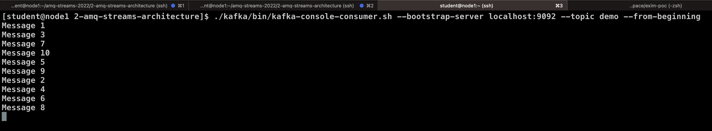

### Send some new messages

  ```bash
  ./kafka/bin/kafka-console-producer.sh --broker-list localhost:9092 --topic demo
  ```
  example result
  
  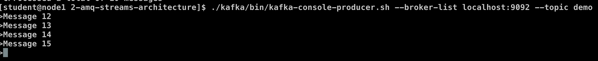

### Start the broker 2 again

* start broker 2 again with command 
  ```bash
  cd ~/amq-streams-2022/2-amq-streams-architecture/
  ./scripts/kafka-2.sh
  ```
* Look again at the topic description with the leaders which changed and new ISR

  ```bash
  ./kafka/bin/kafka-topics.sh --bootstrap-server localhost:9092 --describe --topic demo
  ```
  example result (broker 2 comeback, but leader not change)
  ```bash
  Topic: demo     TopicId: YDf9yjTsTFqA2OPWtzJ4GQ PartitionCount: 3       ReplicationFactor: 3    Configs: segment.bytes=104857600
        Topic: demo     Partition: 0    Leader: 1       Replicas: 1,2,0 Isr: 1,0,2
        Topic: demo     Partition: 1    Leader: 0       Replicas: 0,1,2 Isr: 0,1,2
        Topic: demo     Partition: 2    Leader: 0       Replicas: 2,0,1 Isr: 0,1,2
  ``` 

* Leadership didn't changed, but all replicas are again ISR
* Try to consume the messages again.

  ```bash
  cd ~/amq-streams-2022/2-amq-streams-architecture/
  ./kafka/bin/kafka-console-consumer.sh --bootstrap-server localhost:9092 --topic demo --from-beginning
  ```

