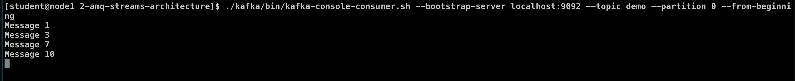

# Red Hat AMQ Streams Architecture

<!-- TOC -->

- [Red Hat AMQ Streams Architecture](#red-hat-amq-streams-architecture)
  - [Prerequisite](#prerequisite)
  - [Clean AMQ Streams Data](#clean-amq-streams-data)
  - [Generate the certificates](#generate-the-certificates)
  - [Start ZooKeeper cluster](#start-zookeeper-cluster)
  - [Start Kafka cluster](#start-kafka-cluster)
  - [Zookeeper](#zookeeper)
    - [Show what Kafka does in Zookeeper](#show-what-kafka-does-in-zookeeper)
  - [Basics Operation with Cluster](#basics-operation-with-cluster)
    - [Create topic](#create-topic)
    - [Check the created topic](#check-the-created-topic)
    - [Send some messages](#send-some-messages)
    - [Consume messages](#consume-messages)
  - [Replication](#replication)
    - [Test Broker crash](#test-broker-crash)
    - [Consume messages](#consume-messages-1)
    - [Send some new messages](#send-some-new-messages)
    - [Start the broker 2 again](#start-the-broker-2-again)
  - [Consumer Groups](#consumer-groups)
    - [Create a new topic (delete and create new again)](#create-a-new-topic-delete-and-create-new-again)
    - [Setup consumers](#setup-consumers)
    - [Send messages](#send-messages)
    - [Rebalancing consumer group](#rebalancing-consumer-group)
    - [Message replay](#message-replay)
  - [Secure Client to Broker Cluster](#secure-client-to-broker-cluster)
    - [Configuration](#configuration)
    - [SSL Consumers and Producers](#ssl-consumers-and-producers)
    - [SASL Consumers and Producers](#sasl-consumers-and-producers)
    - [Topics \& Partition Information](#topics--partition-information)

<!-- /TOC -->

## Prerequisite

* [Setup Red Hat AMQ Streams Lab](./../setup.md)
 
## Clean AMQ Streams Data

* clear zookeeper & kafka data
  ```bash
  rm -rf /tmp/zookeeper*
  rm -rf /tmp/kafka*
  ```

## Generate the certificates 
* create certificate for enable ssl connection to amq streams cluster
* review [generate.sh](ssl/generate.sh) and run for create certificate
  ```bash
  cd ~/amq-streams-2022/2-amq-streams-architecture/
  ./ssl/generate.sh
  ```
* example result of generate.sh (path ~/amq-streams-2022/2-amq-streams-architecture/ssl/keys)
  
  
## Start ZooKeeper cluster

First before we start Kafka, we have to start ZooKeeper cluster.
We will use 3 node cluster.
Start the 3 Zookeeper nodes by running these 3 scripts in different terminals.
Don't worry about error after run zookeeper-0.sh (error about QuorumPeer):

* Look at the Zookeeper config files in `./configs/zookeeper/`, review [zookeeper-1.properties](configs/zookeeper/zookeeper-1.properties), zookeeper-2.properties, zookeeper-3.properties
  - Look at the ensemble configuration in the Zookeeper properties files
  - Check the content of the Zookeeper data dirs in `/tmp`
  - Notice the `myid` file which needs to be created before starting Zookeeper with the node ID 
  - client port
  - zookeeper server list (server.1,server.2,server.3)
  - client to server security config (this lab use 'SASL')
  - server to server security config (this lab use 'SASL')
* review [jaas.config](configs/zookeeper/jaas.config) for authentication information
* run start zookeeper command in different terminal (1 shell script 1 terminal)
  ```bash
  cd ~/amq-streams-2022/2-amq-streams-architecture/
  ./scripts/zookeeper-0.sh
  ./scripts/zookeeper-1.sh
  ./scripts/zookeeper-2.sh
  ```
  example result
  
 
## Start Kafka cluster 

We will use 3 node Kafka cluster
Start the 3 Kafka nodes by running these 3 scripts in different terminals:

* Look at the Kafka configuration files in `./configs/kafka/`, review [server-0.properties](configs/kafka/server-0.properties), server-1.properties, server-2.properties
  - `broker.id`
  - listeners, advertised listeners, protocols
  - Zookeeper config
  - Look at the data dir in `/tmp`
  - Look at the tools in `./kafka/bin`
  - SASL, SSL (server to server, kafka to kafka & zookeeper to kafka use SASL Plaintext in this lab)
* review [jaas.config](configs/kafka/jaas.config) for authentication information
* run start kafka broker command in different terminal
  ```bash
  cd ~/amq-streams-2022/2-amq-streams-architecture/
  ./scripts/kafka-0.sh
  ./scripts/kafka-1.sh
  ./scripts/kafka-2.sh
  ```
  example result
  
  

## Zookeeper

### Show what Kafka does in Zookeeper

* open new terminal
* Find and notice the ZK JAR files in `./kafka/libs` and `./kafka/bin` - Zookeeper is integrated into Kafka distribution
* Start the ZK client
  ```bash
  cd ~/amq-streams-2022/2-amq-streams-architecture/
  ./kafka/bin/zookeeper-shell.sh localhost:2181
  ```

* Browse through the Zookeeper nodes with below command
  ```bash
  ls /
  get /controller
  ls /brokers
  ls /brokers/ids
  get /brokers/ids/0
  ls /brokers/topics
  ```
  example result
  

* Exit from zookeeper-shell with ctrl+c
* Try to do netcat dump with connected brokers

  ```bash
  echo dump | nc localhost 2181
  ```
  example result
  ```bash
  [student@node1 2-amq-streams-architecture]$ echo dump | nc localhost 2181
  SessionTracker dump:
  Global Sessions(4):
  0x100000d21e00000       18000ms
  0x100000d21e00001       30000ms
  0x300000d42930000       18000ms
  0x300000d42930001       18000ms
  ephemeral nodes dump:
  Sessions with Ephemerals (3):
  0x100000d21e00000:
          /controller
          /brokers/ids/0
  0x300000d42930000:
          /brokers/ids/1
  0x300000d42930001:
          /brokers/ids/2
  Connections dump:
  Connections Sets (4)/(2):
  0 expire at Fri Nov 11 04:16:53 UTC 2022:
  1 expire at Fri Nov 11 04:17:03 UTC 2022:
          ip: /0:0:0:0:0:0:0:1:50356 sessionId: 0x0
  1 expire at Fri Nov 11 04:17:13 UTC 2022:
          ip: /127.0.0.1:35092 sessionId: 0x100000d21e00000
  0 expire at Fri Nov 11 04:17:23 UTC 2022:
  [student@node1 2-amq-streams-architecture]$
  ```

* Kill broker 2 (type ctrl+c in kafka broker terminal #3) and do the netcat again to see how it disappeared
    
  ```bash
  echo dump | nc localhost 2181
  ```
  example result after kill broker 2
  ```bash
  [student@node1 2-amq-streams-architecture]$ echo dump | nc localhost 2181
  SessionTracker dump:
  Global Sessions(2):
  0x100000d21e00000       18000ms
  0x300000d42930000       18000ms
  ephemeral nodes dump:
  Sessions with Ephemerals (2):
  0x100000d21e00000:
          /controller
          /brokers/ids/0
  0x300000d42930000:
          /brokers/ids/1
  Connections dump:
  Connections Sets (2)/(2):
  0 expire at Fri Nov 11 04:31:53 UTC 2022:
  2 expire at Fri Nov 11 04:32:03 UTC 2022:
          ip: /0:0:0:0:0:0:0:1:50396 sessionId: 0x0
          ip: /127.0.0.1:35092 sessionId: 0x100000d21e00000
  [student@node1 2-amq-streams-architecture]$
  ```
* start broker 2 again with command 
  ```bash
  cd ~/amq-streams-2022/2-amq-streams-architecture/
  ./scripts/kafka-2.sh
  ```
  
## Basics Operation with Cluster

### Create topic

  ```bash
  ./kafka/bin/kafka-topics.sh --bootstrap-server localhost:9092,localhost:9093,localhost:9094 --create --topic demo --partitions 3   --replication-factor 3
  ```
  example result
  ```bash
  Created topic demo.
  ```
### Check the created topic

  ```bash
  ./kafka/bin/kafka-topics.sh --bootstrap-server localhost:9093 --list
  ./kafka/bin/kafka-topics.sh --bootstrap-server localhost:9094 --describe --topic demo
  ```
  example result
  ```bash
  [student@node1 2-amq-streams-architecture]$ ./kafka/bin/kafka-topics.sh --bootstrap-server localhost:9094 --describe --topic demo
  Topic: demo     TopicId: YDf9yjTsTFqA2OPWtzJ4GQ PartitionCount: 3       ReplicationFactor: 3    Configs: segment.bytes=104857600
          Topic: demo     Partition: 0    Leader: 1       Replicas: 1,2,0 Isr: 1,2,0
          Topic: demo     Partition: 1    Leader: 0       Replicas: 0,1,2 Isr: 0,1,2
          Topic: demo     Partition: 2    Leader: 2       Replicas: 2,0,1 Isr: 2,0,1
  [student@node1 2-amq-streams-architecture]$
  ```
  Notice the distribution of leaders and the ISR replicas.

### Send some messages

* Send at least 10 messages (e.g. `Message 1`, `Message 2` etc. to be able to notice the ordering later), exit command with ctrl+c

  ```bash
  ./kafka/bin/kafka-console-producer.sh --broker-list localhost:9092 --topic demo
  ```
  example result
  

### Consume messages

* Read from the whole topic

  ```bash
  ./kafka/bin/kafka-console-consumer.sh --bootstrap-server localhost:9093 --topic demo --from-beginning
  ```
  example result
  

* Notice how the messages are out of order. And check how nicely ordered they are in a single partition.

  ```bash
  ./kafka/bin/kafka-console-consumer.sh --bootstrap-server localhost:9092 --topic demo --partition 0 --from-beginning
  ```
  example result
  

* Reading from a particular offset

  ```bash
  ./kafka/bin/kafka-console-consumer.sh --bootstrap-server localhost:9092 --topic demo --partition 0 --offset 2
  ```
  example result
  

## Replication

### Test Broker crash

* View topic description with the leaders  and new ISR

  ```bash
  ./kafka/bin/kafka-topics.sh --bootstrap-server localhost:9092 --describe  --topic demo
  ```
  example result
  ```bash
  Topic: demo     TopicId: YDf9yjTsTFqA2OPWtzJ4GQ PartitionCount: 3       ReplicationFactor: 3    Configs: segment.bytes=1073741824
        Topic: demo     Partition: 0    Leader: 1       Replicas: 1,2,0 Isr: 1,2,0
        Topic: demo     Partition: 1    Leader: 0       Replicas: 0,1,2 Isr: 0,1,2
        Topic: demo     Partition: 2    Leader: 2       Replicas: 2,0,1 Isr: 2,0,1
  ```

* Kill broker 2 by ctrl+c in kafka terminal #2 (broker start with 0,1,2)
  
* Look again at the topic description with the leaders which changed and new ISR

  ```bash
  ./kafka/bin/kafka-topics.sh --bootstrap-server localhost:9092 --describe --topic demo
  ```
  example result (partition 2 change leader to broker 0)
  ```bash
  Topic: demo     TopicId: YDf9yjTsTFqA2OPWtzJ4GQ PartitionCount: 3       ReplicationFactor: 3    Configs: segment.bytes=104857600
        Topic: demo     Partition: 0    Leader: 1       Replicas: 1,2,0 Isr: 1,0
        Topic: demo     Partition: 1    Leader: 0       Replicas: 0,1,2 Isr: 0,1
        Topic: demo     Partition: 2    Leader: 0       Replicas: 2,0,1 Isr: 0,1
  ```

### Consume messages

* Try to consume the messages again to confirm that replication worked and that the messages are still in the topic!

  ```bash
  ./kafka/bin/kafka-console-consumer.sh --bootstrap-server localhost:9092 --topic demo --from-beginning
  ```
  example result
  

### Send some new messages

  ```bash
  ./kafka/bin/kafka-console-producer.sh --broker-list localhost:9092 --topic demo
  ```
  example result
  

### Start the broker 2 again

* start broker 2 again with command 
  ```bash
  cd ~/amq-streams-2022/2-amq-streams-architecture/
  ./scripts/kafka-2.sh
  ```
* Look again at the topic description with the leaders which changed and new ISR

  ```bash
  ./kafka/bin/kafka-topics.sh --bootstrap-server localhost:9092 --describe --topic demo
  ```
  example result (broker 2 comeback, but leader not change)
  ```bash
  xTopic: demo     TopicId: YDf9yjTsTFqA2OPWtzJ4GQ PartitionCount: 3       ReplicationFactor: 3    Configs: segment.bytes=104857600
        Topic: demo     Partition: 0    Leader: 1       Replicas: 1,2,0 Isr: 1,0,2
        Topic: demo     Partition: 1    Leader: 0       Replicas: 0,1,2 Isr: 0,1,2
        Topic: demo     Partition: 2    Leader: 0       Replicas: 2,0,1 Isr: 0,1,2
  ``` 

* Leadership didn't changed, but all replicas are again ISR

## Consumer Groups

### Create a new topic (delete and create new again)

  ```bash
  ./kafka/bin/kafka-topics.sh --bootstrap-server localhost:9092 --delete --topic demo
  ./kafka/bin/kafka-topics.sh --bootstrap-server localhost:9092 --list
  ./kafka/bin/kafka-topics.sh --bootstrap-server localhost:9092 --create --topic demo --partitions 3 --replication-factor 3
  ./kafka/bin/kafka-topics.sh --bootstrap-server localhost:9092 --list
  ./kafka/bin/kafka-topics.sh --bootstrap-server localhost:9092 --describe --topic demo
  ```

### Setup consumers

* Open 3 consumers using the same group `group-1`

  ```bash
  ./kafka/bin/kafka-console-consumer.sh --bootstrap-server localhost:9092 --topic demo --from-beginning --property print.key=true --property key.separator=":" --group group-1
  ```
  example result
  

* Open consumer using a different group `group-2`

  ```bash
  ./kafka/bin/kafka-console-consumer.sh --bootstrap-server localhost:9092 --topic demo --from-beginning  --property print.key=true --property key.separator=":" --group group-2
  ```
  example result
  

### Send messages

* Send some messages with keys (Send messages in the format `key:payload` - e.g. `my-key:my-value`)

  ```bash
  ./kafka/bin/kafka-console-producer.sh --broker-list localhost:9092 --topic demo --property "parse.key=true" --property "key.separator=:"
  ```
  - example result
  
  - example result after send message
  

### Rebalancing consumer group

* Kill one of the consumers started before 
  - example kill consumer group-1 terminal #2
  
* Send some messages with the same key as was used before for this consumer
* Notice that one of the other consumers got the partition assigned and will receive it
  - example result
  
  
### Message replay

* kill all previous consumer
* Consume the messages from Kafka with a new group:

  ```bash
  ./kafka/bin/kafka-console-consumer.sh --bootstrap-server localhost:9092 --topic demo --from-beginning  --property print.key=true --property key.separator=":" --group replay-group
  ```
  example result
  
  
* After it consumes all messages, try to restart it to make sure they were all committed - no messages should be received
  
  example result
  
  
* kill all consumer (with ctrl+c)
* List all the groups:

  ```bash
  ./kafka/bin/kafka-consumer-groups.sh --bootstrap-server localhost:9092 --all-groups --list
  ```
  example result
  

* Or describe them:

  ```bash
  ./kafka/bin/kafka-consumer-groups.sh --bootstrap-server localhost:9092 --all-groups --describe
  ```
  example result (view current-offset, log-end-offset, lag)
  

* Go and reset the offset to 0: with --to-earliest (other option such as set to last offset with --to-latest)

  ```bash
  ./kafka/bin/kafka-consumer-groups.sh --bootstrap-server localhost:9092 --reset-offsets --to-earliest --group replay-group --topic demo --execute
  ```
  example result
  

* Try to consume the messages again - you should receive them from the beginning of the topic:

  ```bash
  ./kafka/bin/kafka-console-consumer.sh --bootstrap-server localhost:9092 --topic demo --from-beginning  --property print.key=true --property key.separator=":" --group replay-group
  ```
  example result
  

## Secure Client to Broker Cluster

### Configuration

* Look in the configuration files of the brokers (`./configs/kafka/`) such as [server-0.properties](./configs/kafka/server-0.properties) and check the fields related to the TLS & SASL.
  - example configuration
    ```properties
    ############################# SASL #############################

    sasl.enabled.mechanisms=PLAIN,SCRAM-SHA-256,SCRAM-SHA-512
    sasl.mechanism.inter.broker.protocol=PLAIN

    ############################# SSL #############################

    # Configures kafka broker to request client authentication. The following settings are common:
    #ssl.client.auth=required If set to required client authentication is required.
    #ssl.client.auth=requested This means client authentication is optional. unlike requested , if this option is set client can choose not to provide authentication information about itself
    #ssl.client.auth=none This means client authentication is not needed.
    ssl.client.auth=required

    # The location of the key store file. This is optional for client and can be used for two-way authentication for client.
    ssl.keystore.location=./ssl/keys/server-0.keystore

    # The store password for the key store file. This is optional for client and only needed if ssl.keystore.location is configured.
    ssl.keystore.password=123456

    # The location of the trust store file.
    ssl.truststore.location=./ssl/keys/truststore

    # The password for the trust store file. If a password is not set access to the truststore is still available, but integrity checking is disabled.
    ssl.truststore.password=123456
    ```

### SSL Consumers and Producers

* Use SSL to producer messages:

  ```bash
  ./kafka/bin/kafka-console-producer.sh --broker-list localhost:19092 \
      --topic demo \
      --producer-property security.protocol=SSL \
      --producer-property ssl.truststore.password=123456 \
      --producer-property ssl.truststore.location=./ssl/keys/truststore \
      --producer-property ssl.keystore.password=123456 \
      --producer-property ssl.keystore.location=./ssl/keys/user1.keystore
  ```

* And consume them:

  ```bash
  ./kafka/bin/kafka-console-consumer.sh --bootstrap-server localhost:19092 \
      --topic demo --from-beginning \
      --consumer-property security.protocol=SSL \
      --consumer-property ssl.truststore.password=123456 \
      --consumer-property ssl.truststore.location=./ssl/keys/truststore \
      --consumer-property ssl.keystore.password=123456 \
      --consumer-property ssl.keystore.location=./ssl/keys/user1.keystore
  ```

### SASL Consumers and Producers

* Check the [sasl-client.properties](sasl-client.properties) file  which configures SASL PLAIN authentication 
* Try to producer some messages:

  ```bash
  ./kafka/bin/kafka-console-producer.sh --broker-list localhost:39092 \
      --topic demo \
      --producer.config sasl-client.properties
  ```

* And consume them:

  ```bash
  ./kafka/bin/kafka-console-consumer.sh --bootstrap-server localhost:39092 \
      --topic demo --from-beginning \
      --consumer.config sasl-client.properties
  ```

### Topics & Partition Information
* check demo topic already in cluster
  ```bash
  cd ~/amq-streams-2022/4-management/
  ./kafka/bin/kafka-topics.sh --bootstrap-server localhost:9092 --list
  ```
  example result
  ```bash
  __consumer_offsets
  demo
  ```
* We already used a lot of commands. You can also use the script to show only some topics in _troubles_:
  * '--under-replicated-partitions' --> displays the number of partitions that do not have enough replicas to meet the desired replication factor.
  * '--unavailable-partitions' --> list partitions that currently don't have a leader and hence cannot be used by Consumers or Producers.

  ```bash
  ./kafka/bin/kafka-topics.sh --bootstrap-server localhost:9092 --describe
  ./kafka/bin/kafka-topics.sh --bootstrap-server localhost:9092 --describe --under-replicated-partitions
  ./kafka/bin/kafka-topics.sh --bootstrap-server localhost:9092 --describe --unavailable-partitions
  ```

