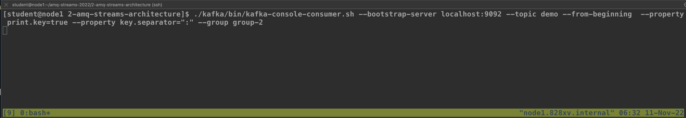
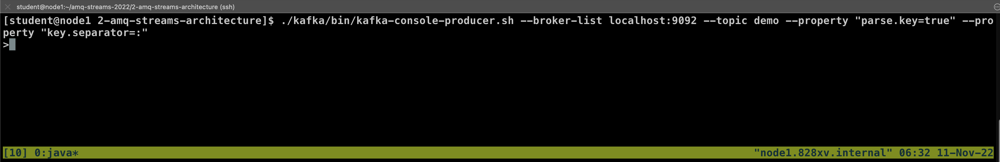
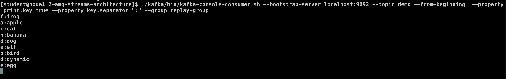
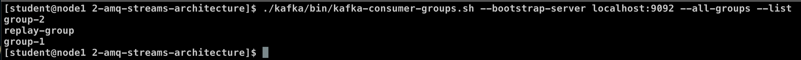

# Consumer and Producer

<!-- TOC -->

- [Consumer and Producer](#consumer-and-producer)
  - [Prerequisite](#prerequisite)
  - [Start Cluster](#start-cluster)
  - [Consumer Groups](#consumer-groups)
    - [Create a new topic (delete and create new again)](#create-a-new-topic-delete-and-create-new-again)
    - [Setup consumers](#setup-consumers)
    - [Send messages](#send-messages)
    - [Rebalancing consumer group](#rebalancing-consumer-group)
    - [Message replay](#message-replay)
  - [Secure Client to Broker Cluster](#secure-client-to-broker-cluster)
    - [Configuration](#configuration)
    - [SSL Consumers and Producers](#ssl-consumers-and-producers)
    - [SASL Consumers and Producers](#sasl-consumers-and-producers)
  - [Topics \& Partition Information](#topics--partition-information)
  - [Consumer \& Producer API](#consumer--producer-api)

<!-- /TOC -->

## Prerequisite

* [Setup Red Hat AMQ Streams Lab](./../setup.md)
* [Red Hat AMQ Streams Architecture](../2-amq-streams-architecture/architecture.md)

## Start Cluster

* make sure to stop all kafka & zookeeper server
  * by ctrl+c in your terminal or
  * call kafka-server-stop.sh for kafka broker and call zookeeper-server-stop.sh for zookeeper
  * make sure with jps command
* clear zookeeper & kafka data
  ```bash
  rm -rf /tmp/zookeeper*
  rm -rf /tmp/kafka*
  ```
  
* start the Zookeeper and Kafka cluster from the [Red Hat AMQ Streams Architecture](../2-amq-streams-architecture/architecture.md). This cluster will be used for this lab. run cli in each terminal (1 shell script 1 terminal)
  ```bash
  cd ~/amq-streams-2022/2-amq-streams-architecture/
  ./scripts/zookeeper-0.sh
  ./scripts/zookeeper-1.sh
  ./scripts/zookeeper-2.sh
  ./scripts/kafka-0.sh
  ./scripts/kafka-1.sh
  ./scripts/kafka-2.sh
  ```
  

## Consumer Groups

### Create a new topic (delete and create new again)

  ```bash
  cd ~/amq-streams-2022/2-amq-streams-architecture/
  ./kafka/bin/kafka-topics.sh --bootstrap-server localhost:9092 --delete --topic demo
  ./kafka/bin/kafka-topics.sh --bootstrap-server localhost:9092 --list
  ./kafka/bin/kafka-topics.sh --bootstrap-server localhost:9092 --create --topic demo --partitions 3 --replication-factor 3
  ./kafka/bin/kafka-topics.sh --bootstrap-server localhost:9092 --list
  ./kafka/bin/kafka-topics.sh --bootstrap-server localhost:9092 --describe --topic demo
  ```

### Setup consumers

* Open 3 consumers using the same group `group-1`

  ```bash
  cd ~/amq-streams-2022/2-amq-streams-architecture/
  ./kafka/bin/kafka-console-consumer.sh --bootstrap-server localhost:9092 --topic demo --from-beginning --property print.key=true --property key.separator=":" --group group-1
  ```
  example result
  
  

* New Terminal and Open consumer using a different group `group-2`

  ```bash
  cd ~/amq-streams-2022/2-amq-streams-architecture/
  ./kafka/bin/kafka-console-consumer.sh --bootstrap-server localhost:9092 --topic demo --from-beginning  --property print.key=true --property key.separator=":" --group group-2
  ```
  example result
  
  

### Send messages

* New Terminal and Send some messages with keys (Send messages in the format `key:payload` - e.g. `my-key:my-value`)

  ```bash
  cd ~/amq-streams-2022/2-amq-streams-architecture/
  ./kafka/bin/kafka-console-producer.sh --broker-list localhost:9092 --topic demo --property "parse.key=true" --property "key.separator=:"
  ```
  example result (send message such as "a:apple", "b:bird")
  
  

  example result after send message
  
  

### Rebalancing consumer group

* Kill one of the consumers group 1
  
  example kill consumer group-1 terminal #2
  
  
  
* Send some messages with the same key as was used before for this consumer
* Notice that one of the other consumers got the partition assigned and will receive it
  
  example result
  
  
  
### Message replay

* kill all previous consumer and producer
* Consume the messages from Kafka with a new group:

  ```bash
  cd ~/amq-streams-2022/2-amq-streams-architecture/
  ./kafka/bin/kafka-console-consumer.sh --bootstrap-server localhost:9092 --topic demo --from-beginning  --property print.key=true --property key.separator=":" --group replay-group
  ```
  example result
  
  
  
* After it consumes all messages, try to restart it to make sure they were all committed - no messages should be received
  
  example result
  
  
  
* kill all consumer (with ctrl+c)
* List all the groups:

  ```bash
  ./kafka/bin/kafka-consumer-groups.sh --bootstrap-server localhost:9092 --all-groups --list
  ```
  example result
  
  

* Or describe them:

  ```bash
  ./kafka/bin/kafka-consumer-groups.sh --bootstrap-server localhost:9092 --all-groups --describe
  ```
  example result (view current-offset, log-end-offset, lag)
  
  

* Go and reset the offset to 0: with --to-earliest (other option such as set to last offset with --to-latest)

  ```bash
  ./kafka/bin/kafka-consumer-groups.sh --bootstrap-server localhost:9092 --reset-offsets --to-earliest --group replay-group --topic demo --execute
  ```
  example result
  
  

* Try to consume the messages again - you should receive them from the beginning of the topic:

  ```bash
  ./kafka/bin/kafka-console-consumer.sh --bootstrap-server localhost:9092 --topic demo --from-beginning  --property print.key=true --property key.separator=":" --group replay-group
  ```
  example result
  
  

## Secure Client to Broker Cluster

### Configuration

* Look in the configuration files of the brokers (`./configs/kafka/`) such as [server-0.properties](./configs/kafka/server-0.properties) and check the fields related to the TLS & SASL.
  - example configuration
    ```properties
    ############################# SASL #############################

    sasl.enabled.mechanisms=PLAIN,SCRAM-SHA-256,SCRAM-SHA-512
    sasl.mechanism.inter.broker.protocol=PLAIN

    ############################# SSL #############################

    # Configures kafka broker to request client authentication. The following settings are common:
    #ssl.client.auth=required If set to required client authentication is required.
    #ssl.client.auth=requested This means client authentication is optional. unlike requested , if this option is set client can choose not to provide authentication information about itself
    #ssl.client.auth=none This means client authentication is not needed.
    ssl.client.auth=required

    # The location of the key store file. This is optional for client and can be used for two-way authentication for client.
    ssl.keystore.location=./ssl/keys/server-0.keystore

    # The store password for the key store file. This is optional for client and only needed if ssl.keystore.location is configured.
    ssl.keystore.password=123456

    # The location of the trust store file.
    ssl.truststore.location=./ssl/keys/truststore

    # The password for the trust store file. If a password is not set access to the truststore is still available, but integrity checking is disabled.
    ssl.truststore.password=123456
    ```

### SSL Consumers and Producers

* Use SSL to producer messages:

  ```bash
  cd ~/amq-streams-2022/2-amq-streams-architecture/
  ./kafka/bin/kafka-console-producer.sh --broker-list localhost:19092 \
      --topic demo \
      --producer-property security.protocol=SSL \
      --producer-property ssl.truststore.password=123456 \
      --producer-property ssl.truststore.location=./ssl/keys/truststore \
      --producer-property ssl.keystore.password=123456 \
      --producer-property ssl.keystore.location=./ssl/keys/user1.keystore
  ```

* And consume them:

  ```bash
  cd ~/amq-streams-2022/2-amq-streams-architecture/
  ./kafka/bin/kafka-console-consumer.sh --bootstrap-server localhost:19092 \
      --topic demo --from-beginning \
      --consumer-property security.protocol=SSL \
      --consumer-property ssl.truststore.password=123456 \
      --consumer-property ssl.truststore.location=./ssl/keys/truststore \
      --consumer-property ssl.keystore.password=123456 \
      --consumer-property ssl.keystore.location=./ssl/keys/user1.keystore
  ```

### SASL Consumers and Producers

* Check the [sasl-client.properties](sasl-client.properties) file  which configures SASL PLAIN authentication 
* Try to producer some messages:

  ```bash
  cd ~/amq-streams-2022/2-amq-streams-architecture/
  ./kafka/bin/kafka-console-producer.sh --broker-list localhost:39092 \
      --topic demo \
      --producer.config sasl-client.properties
  ```

* And consume them:

  ```bash
  cd ~/amq-streams-2022/2-amq-streams-architecture/
  ./kafka/bin/kafka-console-consumer.sh --bootstrap-server localhost:39092 \
      --topic demo --from-beginning \
      --consumer.config sasl-client.properties
  ```

## Topics & Partition Information
* check demo topic already in cluster
  ```bash
  cd ~/amq-streams-2022/2-amq-streams-architecture/
  ./kafka/bin/kafka-topics.sh --bootstrap-server localhost:9092 --list
  ```
  example result
  ```bash
  __consumer_offsets
  demo
  ```
* We already used a lot of commands. You can also use the script to show only some topics in _troubles_:
  * '--under-replicated-partitions' --> displays the number of partitions that do not have enough replicas to meet the desired replication factor.
  * '--unavailable-partitions' --> list partitions that currently don't have a leader and hence cannot be used by Consumers or Producers.

  ```bash
  ./kafka/bin/kafka-topics.sh --bootstrap-server localhost:9092 --describe
  ./kafka/bin/kafka-topics.sh --bootstrap-server localhost:9092 --describe --under-replicated-partitions
  ./kafka/bin/kafka-topics.sh --bootstrap-server localhost:9092 --describe --unavailable-partitions
  ```

## Consumer & Producer API

* Create new topic for test messages:

  ```bash
  cd ~/amq-streams-2022/2-amq-streams-architecture/
  ./kafka/bin/kafka-topics.sh --bootstrap-server localhost:9092 --create --topic weather-report --partitions 1 --replication-factor 3
  ```

* Start a console consumer to see the sent messages:

  ```bash
  cd ~/amq-streams-2022/2-amq-streams-architecture/
  ./kafka/bin/kafka-console-consumer.sh --bootstrap-server localhost:9092 --topic weather-report --from-beginning --property print.key=true --property key.separator=":     "
  ```

* Basic Consumer and Producer APIs

  - Review Simple Producer Client Source Code at [ProducerAPI.java](src/main/java/cz/scholz/kafka/basic/ProducerAPI.java) in src/main/java/cz/scholz/kafka/basic folder
  - run simple producer client api
    ```bash
    cd ~/amq-streams-2022/3-consumer-producer/
    mvn compile exec:java -Dexec.mainClass="cz.scholz.kafka.basic.ProducerAPI"
    ```
    
    example result in kafka console consumer
  
    

    example result in ProducerAPI java application

    

  - Review Simple Consumer Client Source Code at [ConsumerAPI.java](src/main/java/cz/scholz/kafka/basic/ConsumerAPI.java) in src/main/java/cz/scholz/kafka/basic folder
  - after producer client complete, run simple consumer client api
    ```bash
    cd ~/amq-streams-2022/3-consumer-producer/
    mvn compile exec:java -Dexec.mainClass="cz.scholz.kafka.basic.ConsumerAPI"
    ```

    example result

    

* Acks and Manual Commits with API
  - Review Acknowledge Config Producer Client (ACKS_CONFIG property set to "all") Source Code at [ProducerAPI.java](src/main/java/cz/scholz/kafka/acks/ProducerAPI.java) in src/main/java/cz/scholz/kafka/acks folder
  - run producer with acks = "all"
    ```bash
    cd ~/amq-streams-2022/3-consumer-producer/
    mvn compile exec:java -Dexec.mainClass="cz.scholz.kafka.acks.ProducerAPI"
    ```
  
    example result
    
    

  - Review Manual Commit Config Consumer Client (default auto commit) Source Code at [ConsumerAPI.java](src/main/java/cz/scholz/kafka/manualcommits/ProducerAPI.java) in src/main/java/cz/scholz/kafka/manaulcommits folder
    - see ENABLE_AUTO_COMMIT_CONFIG property
    - see consumer commit method (sync & async)
  - run consumer with async commit
    ```bash
    cd ~/amq-streams-2022/3-consumer-producer/
    mvn compile exec:java -Dexec.mainClass="cz.scholz.kafka.manualcommits.ConsumerAPI"
    ```
    
    example result
    
    

- SSL and SSL Authentication with API
  - Review SSL Config Producer Client (SSL* property) Source Code at [ProducerAPI.java](src/main/java/cz/scholz/kafka/ssl/ProducerAPI.java) in src/main/java/cz/scholz/kafka/ssl folder
  - run producer with ssl
    ```bash
    cd ~/amq-streams-2022/3-consumer-producer/
    mvn compile exec:java -Dexec.mainClass="cz.scholz.kafka.ssl.ProducerAPI"
    ```

    example result

    

  - Review SSL Config Consumer Client (SSL* property) Source Code at [ConsumerAPI.java](src/main/java/cz/scholz/kafka/ssl/ConsumerAPI.java) in src/main/java/cz/scholz/kafka/ssl folder
  - run consumer with ssl
    ```bash
    cd ~/amq-streams-2022/3-consumer-producer/
    mvn compile exec:java -Dexec.mainClass="cz.scholz.kafka.ssl.ConsumerAPI"
    ``` 

    example result

    

- SASL with API
  - Review SASL Config Producer Client (SASL* property) Source Code at [ProducerAPI.java](src/main/java/cz/scholz/kafka/sasl/ProducerAPI.java) in src/main/java/cz/scholz/kafka/sasl folder
  - run producer with sasl  
    ```bash
    cd ~/amq-streams-2022/3-consumer-producer/
    mvn compile exec:java -Dexec.mainClass="cz.scholz.kafka.sasl.ProducerAPI"
    ```

    example result

    
    
  - Review SASL Config Consumer Client (SASL* property) Source Code at [ConsumerAPI.java](src/main/java/cz/scholz/kafka/sasl/ConsumerAPI.java) in src/main/java/cz/scholz/kafka/sasl folder
  - run consumer with sasl
    ```bash
    cd ~/amq-streams-2022/3-consumer-producer/
    mvn compile exec:java -Dexec.mainClass="cz.scholz.kafka.sasl.ConsumerAPI"
    ``` 

    example result

    
    

- Serialization and deserialization with API
  - Review Serialization Producer Client Source Code at [ProducerAPI.java](src/main/java/cz/scholz/kafka/serialization/ProducerAPI.java) in src/main/java/cz/scholz/kafka/serialization folder
  - run producer with serialization
    ```
    cd ~/amq-streams-2022/3-consumer-producer/
    mvn compile exec:java -Dexec.mainClass="cz.scholz.kafka.serialization.ProducerAPI"
    ```

    example result

    

  - Review DeSerialization Consumer Client Source Code at [ConsumerAPI.java](src/main/java/cz/scholz/kafka/serialization/ConsumerAPI.java) in src/main/java/cz/scholz/kafka/serialization folder
    - run consumer with serialization
    ```
    cd ~/amq-streams-2022/3-consumer-producer/
    mvn compile exec:java -Dexec.mainClass="cz.scholz.kafka.serialization.ConsumerAPI"
    ``` 

    example result

    