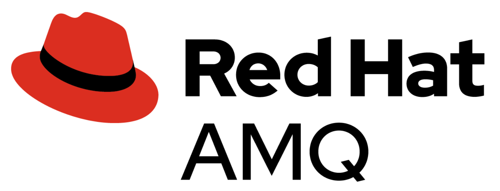

# Red Hat AMQ Streams Training 2022

## Table of Contents
- [Setup Red Hat AMQ Streams Lab](setup.md)
- [Introduction to Red Hat AMQ Streams](./1-introduction-amq-streams/intro.md)
- [Red Hat AMQ Streams Architecture](./2-amq-streams-architecture/architecture.md)
- [Consumer & Producer](./3-consumer-producer/client.md)
- [Reassign Partition](./4-management/reassign.md)
- [Cruise Control](./4-management/cruisecontrol.md)
- [Monitoring](./4-management/monitor.md)
- [Authentication & Authorization](./5-basic-acl/acl.md)
- [HTTP Bridge](./6-http-bridge/bridge.md)
- [Service Registry](./7-service-registry/registry.md)

## [Gitbook](https://chatapazar.gitbook.io/amq-streams-training-2022/) version
