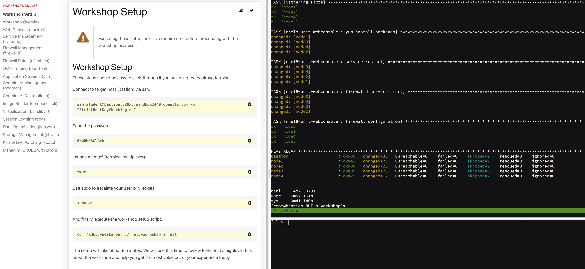
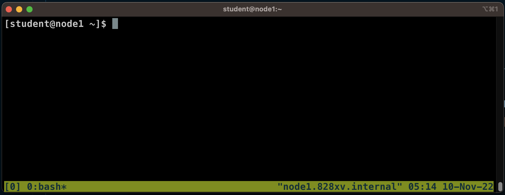

# Setup Red Hat AMQ Streams Lab

Following below instruction for prepare lab environment:

<!-- TOC -->

- [Setup Red Hat AMQ Streams Lab](#setup-red-hat-amq-streams-lab)
  - [Prepare Lab (Instructor Task, for RHPDS only)](#prepare-lab-instructor-task-for-rhpds-only)
  - [Connect to RHPDS VM Lab](#connect-to-rhpds-vm-lab)
  - [Prerequisite Software](#prerequisite-software)
  - [Clone Lab Resource from Git](#clone-lab-resource-from-git)

<!-- /TOC -->

## Prepare Lab (Instructor Task, for RHPDS only)
* base on RHPDS --> "The Definitive RHEL8 Hands-On Lab"
* after success request lab go to bookbag_url to run workshop setup, wait until complete all node.
  
   

## Connect to RHPDS VM Lab 
* Get Lab Server Information from Instructor
  - Lab Information URL: http://xxx.xxx/lab-amq
  - ssh information to bastion such as ssh student@bastion.828xv.sandbox2440.opentlc.com
  - bastion password : xxxxxx
  - your lab node such as node1, node2 or node3
* For Lab on RHPDS, connection flow is your terminal --> bastion --> lab server (node1, node2 or node 3)
* open your terminal
* run secure shell to bastion server (receive ssh command & password from instructor)
  ```bash
  ssh student@bastion.828xv.sandbox2440.opentlc.com
  student@bastion.828xv.sandbox2440.opentlc.com's password: 
  # ---------------
  #  Host FQDN : bastion.828xv.internal
  # OS Version : RedHat 8.4
  # ---------------
  Web console: https://bastion.828xv.internal:443/ or https://192.168.0.176:443/

  Last login: Wed Nov  9 08:52:03 2022 from 171.96.89.23
  [student@bastion ~]$
  ```
* Remark: for the first time to bastion, type "yes" to accept connection.
  ```bash
  The authenticity of host 'bastion.zb75d.sandbox2423.opentlc.com (3.139.121.191)' can't be established.
  ED25519 key fingerprint is SHA256:ZTsaxQSeraZDbwBqsGWGZUPSDPnDFio1Yv3Pes40OTI.
  This key is not known by any other names
  Are you sure you want to continue connecting (yes/no/[fingerprint])?
  ```
* ssh to your node (receive node name from instructor)
  ```bash
  [student@bastion ~]$ ssh node1
  # ---------------
  #  Host FQDN : node1.828xv.internal
  # OS Version : RedHat 8.4
  # ---------------
  Web console: https://node1.828xv.internal:9090/ or https://192.168.0.124:9090/

  Last login: Wed Nov  9 08:52:07 2022 from 192.168.0.176
  [student@node1 ~]$
  ```
* run tmux for for block connection timeout
  ```bash
  [student@node1 ~]$ tmux
  ```
* terminal ready for lab
  
   
  
* Use the same method to open a new terminal or split windows with ctrl+b+" or ctrl+b+% and use ctrl+b+d for close current pane
  
## Prerequisite Software
* install openjdk 11
  - install openjdk 11 command
    ```bash
    cd ~
    sudo yum install -y java-11-openjdk-devel  
    ```
  - test java command
    ```bash
    [student@node1 ~]$ java -version
    openjdk version "11.0.17" 2022-10-18 LTS
    OpenJDK Runtime Environment (Red_Hat-11.0.17.0.8-2.el8_6) (build 11.0.17+8-LTS)
    OpenJDK 64-Bit Server VM (Red_Hat-11.0.17.0.8-2.el8_6) (build 11.0.17+8-LTS, mixed mode, sharing)
    [student@node1 ~]$
    ```
  
* check openssl (rhel already install) for generate/managed ssl
  ```bash
  [student@node1 ~]$ cd ~
  [student@node1 ~]$ openssl version
  OpenSSL 1.1.1g FIPS  21 Apr 2020
  [student@node1 ~]$
  ```

* check & install wget, nc, tmux, maven (if you don't found it in RHEL VM)
  ```bash
  sudo yum install -y tmux
  sudo yum install -y wget
  sudo yum install -y nc
  sudo yum install -y net-tools
  sudo yum install -y maven
  ```
  
* install cfssl, cfssljson (CloudFlare's PKI/TLS toolkit) for generate/managed ssl
  - install cfssl command
    ```bash
    cd ~
    VERSION=$(curl --silent "https://api.github.com/repos/cloudflare/cfssl/releases/latest" | grep '"tag_name"' | sed -E 's/.*"([^"]+)".*/\1/')
    VNUMBER=${VERSION#"v"}
    wget https://github.com/cloudflare/cfssl/releases/download/${VERSION}/cfssl_${VNUMBER}_linux_amd64 -O cfssl
    chmod +x cfssl
    sudo mv cfssl /usr/local/bin
    cfssl version
    ```
  - install cfssljson command
    ```bash
    cd ~
    wget https://github.com/cloudflare/cfssl/releases/download/${VERSION}/cfssljson_${VNUMBER}_linux_amd64 -O cfssljson
    chmod +x cfssljson
    sudo mv cfssljson /usr/local/bin
    cfssljson -version
    ```

* set default java version to 11 (openjdk 8 come with maven install, you must change default to jdk 11)
  * run command to change java version
    ```bash
    sudo alternatives --config java
    ```
    
    example result, type selection number to select java 11 and enter
    ```bash
    There are 2 programs which provide 'java'.

      Selection    Command
    -----------------------------------------------
    + 1           java-11-openjdk.x86_64 (/usr/lib/jvm/java-11-openjdk-11.0.17.0.8-2.el8_6.x86_64/bin/java)
    *  2           java-1.8.0-openjdk.x86_64 (/usr/lib/jvm/java-1.8.0-openjdk-1.8.0.352.b08-2.el8_6.x86_64/jre/bin/java)

    Enter to keep the current selection[+], or type selection number: 1
    ```
    
  * change javac version to 11
    ```bash
    sudo alternatives --config javac
    ```

    example result, type selection number to select java 11 and enter
    ```bash
    There are 2 programs which provide 'javac'.

      Selection    Command
    -----------------------------------------------
    + 1           java-11-openjdk.x86_64 (/usr/lib/jvm/java-11-openjdk-11.0.17.0.8-2.el8_6.x86_64/bin/javac)
    *  2           java-1.8.0-openjdk.x86_64 (/usr/lib/jvm/java-1.8.0-openjdk-1.8.0.352.b08-2.el8_6.x86_64/bin/javac)

    Enter to keep the current selection[+], or type selection number: 1
    ```
  * check java & javac version to 11
    ```bash
    java -version
    openjdk version "11.0.17" 2022-10-18 LTS
    OpenJDK Runtime Environment (Red_Hat-11.0.17.0.8-2.el8_6) (build 11.0.17+8-LTS)
    OpenJDK 64-Bit Server VM (Red_Hat-11.0.17.0.8-2.el8_6) (build 11.0.17+8-LTS, mixed mode, sharing)
    ```

    ```bash
    javac -version
    javac 11.0.17
    ```

## Clone Lab Resource from Git
* clone git from repository URL: https://github.com/chatapazar/amq-streams-2022
* clone git command
  ```bash
  cd ~
  git clone https://github.com/chatapazar/amq-streams-2022
  ```
* check lab resource
  ```bash
  [student@node1 ~]$ cd ~/amq-streams-2022/
  [student@node1 amq-streams-2022]$ ll
  total x
  drwxrwxr-x. 3 student student   36 Nov  9 08:25 1-introduction-amq-streams
  drwxrwxr-x. 6 student student  107 Nov  9 08:25 2-amq-streams-architecture
  .
  .
  .
  [student@node1 amq-streams-2022]$
  ```